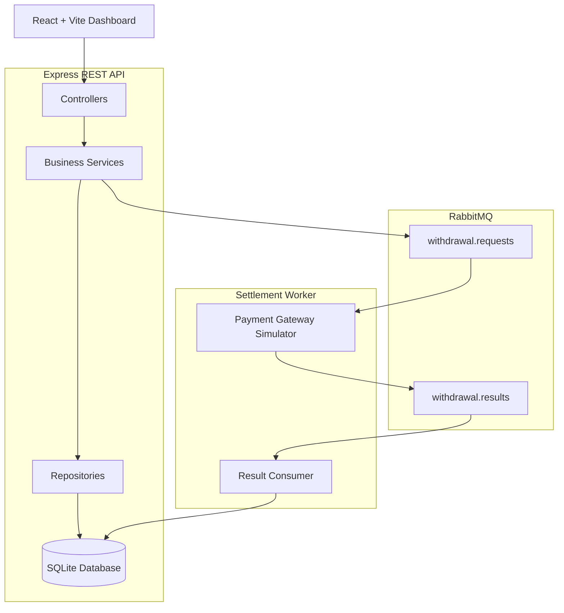
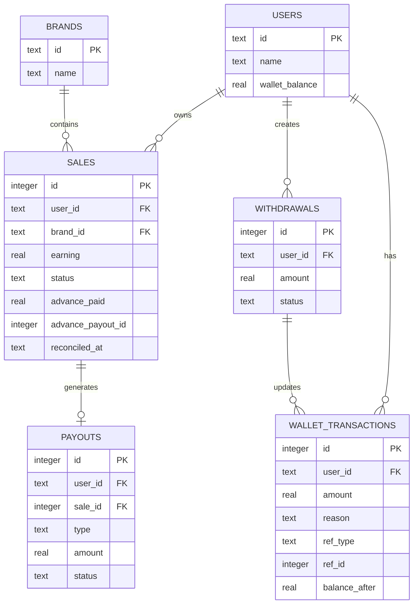

# Affiliate Payout & Reconciliation Management System

A complete implementation of the **SDE Intern Assignment** for designing a scalable affiliate payout management system.

This project demonstrates a complete **Low-Level Design (LLD)** along with a working implementation supporting:

- ✅ Advance payouts (10% for pending affiliate sales)
- ✅ Sale reconciliation (Approved / Rejected)
- ✅ Final payout calculation
- ✅ Automatic clawbacks for rejected sales
- ✅ Wallet management with transaction ledger
- ✅ Withdrawal requests with 24-hour cooldown
- ✅ Failed payout recovery
- ✅ RabbitMQ-based asynchronous payout settlement
- ✅ REST APIs
- ✅ Interactive React dashboard

---

# Table of Contents

1. Project Overview
2. Repository Structure
3. Git Branch Strategy
4. Features
5. Technology Stack
6. System Architecture
7. Database Schema
8. Class Design
9. API Endpoints
10. Design Decisions
11. Assumptions
12. Project Setup
13. Example Workflow
14. Future Improvements

---

# Project Overview

The system manages payouts for affiliate sales.

Every affiliate sale initially enters the system as **Pending**.

Eligible pending sales receive an **Advance Payout** equal to **10%** of the sale's earnings.

Later, an administrator reconciles each sale by marking it as either:

- Approved
- Rejected

The system then calculates the final settlement while ensuring:

- No duplicate advance payouts
- Correct adjustment of rejected sales
- Accurate wallet balance
- Complete audit trail
- Safe concurrent execution
- Automatic recovery from failed withdrawals

---

# Repository Structure

```
.
├── payout-management-system/    # Express Backend
├── payout-ui/                   # React Dashboard
└── README.md
```

## Backend

- Express.js
- SQLite
- RabbitMQ
- Repository-Service Pattern

## Frontend

- React
- Vite
- Responsive Glassmorphism Dashboard

---

# Git Branch Strategy

The project follows a simple multi-environment Git workflow.

| Branch | Purpose |
|---------|---------|
| **main** | Stable production-ready implementation |
| **dev** | Active development branch |
| **qc** | Quality Control branch used for testing and validation |
| **stage** | Pre-production staging branch before merging to main |

Development flow:

```
dev
 ↓
qc
 ↓
stage
 ↓
main
```

This workflow simulates a real-world software development lifecycle where features are developed, tested, validated, staged, and finally released.

---

# Features

## Sales Management

- Create Pending Sales
- View Sales
- Brand Management
- Sale Status Tracking

## Advance Payout

- 10% advance payout
- Idempotent payout execution
- Duplicate payout prevention

## Reconciliation

- Approve Sales
- Reject Sales
- Automatic Clawback
- Final Settlement

## Wallet

- Cached withdrawable balance
- Append-only ledger
- Full audit history

## Withdrawals

- Withdrawal requests
- 24-hour cooldown rule
- RabbitMQ queue processing
- Manual settlement simulation

## Recovery

- Failed payout recovery
- Cancelled payout recovery
- Rejected payout recovery
- Automatic wallet refund

---

# Technology Stack

## Backend

- Node.js
- Express.js
- SQLite
- RabbitMQ

## Frontend

- React
- Vite

## Testing

- Jest

## Documentation

- Mermaid Diagrams
- Markdown

---

# System Architecture



## Components

### Express API

Responsible for

- Sales APIs
- Wallet APIs
- Withdrawal APIs
- Admin APIs

### RabbitMQ

Processes withdrawal requests asynchronously.

### Settlement Worker

Simulates payment gateway callbacks and updates withdrawal status.

### SQLite

Stores

- Users
- Sales
- Wallet
- Transactions
- Withdrawals

---

# Database Schema



---

# Class Design

| Layer | Component | Responsibility |
|--------|------------|---------------|
| Repository | UserRepository | User database access |
| Repository | SaleRepository | Sales persistence |
| Repository | WalletRepository | Wallet operations |
| Repository | WithdrawalRepository | Withdrawal persistence |
| Repository | PayoutRepository | Payout persistence |
| Service | AdvancePayoutService | Advance payout logic |
| Service | ReconciliationService | Sale settlement |
| Service | WalletService | Wallet updates |
| Service | WithdrawalService | Withdrawal creation |
| Service | PayoutFailureRecoveryService | Failed payout recovery |
| Controller | Express Controllers | REST APIs |

---

# API Endpoints

## Health

| Method | Endpoint | Description |
|---------|----------|-------------|
| GET | `/health` | Server health |

---

## Sales

| Method | Endpoint | Description |
|---------|----------|-------------|
| POST | `/sales` | Create sale |
| GET | `/sales` | List sales |

---

## Users

| Method | Endpoint | Description |
|---------|----------|-------------|
| GET | `/users` | List users |
| GET | `/users/:userId/balance` | Wallet balance |
| GET | `/users/:userId/transactions` | Ledger |
| GET | `/users/:userId/withdrawals` | Withdrawal history |

---

## Admin

| Method | Endpoint | Description |
|---------|----------|-------------|
| POST | `/admin/advance-payout/run` | Run advance payout job |
| POST | `/admin/sales/:id/reconcile` | Approve or Reject sale |

---

## Withdrawals

| Method | Endpoint | Description |
|---------|----------|-------------|
| POST | `/users/:userId/withdrawals` | Create withdrawal |
| POST | `/withdrawals/:id/status` | Simulate bank callback |

---

# Design Decisions

## Repository Pattern

Separates persistence logic from business logic.

---

## Service Layer

Encapsulates business rules making controllers lightweight.

---

## Transaction Safety

Every financial operation executes inside a database transaction using SQLite `BEGIN IMMEDIATE`.

This prevents:

- Double payouts
- Race conditions
- Concurrent withdrawal issues

---

## Idempotent Advance Payout

Advance payouts only execute when:

```
status = 'pending'
AND advance_payout_id IS NULL
```

Running the scheduler multiple times never creates duplicate payouts.

---

## Cached Wallet Balance

Wallet balance is stored inside the Users table for fast reads.

The append-only transaction ledger remains the source of truth.

---

## Append-Only Ledger

Every money movement creates a transaction entry.

Examples:

- Advance payout
- Final payout
- Clawback
- Withdrawal
- Withdrawal refund

No ledger entry is ever modified or deleted.

---

## RabbitMQ

Withdrawals are processed asynchronously to simulate communication with an external payment gateway.

---

## Failure Recovery

If a withdrawal becomes

- FAILED
- REJECTED
- CANCELLED

the system automatically:

- Refunds the wallet
- Creates a reversal ledger entry
- Removes withdrawal cooldown

---

# Assumptions

- Every pending sale is eligible for one advance payout.
- Advance payout is always 10%.
- A sale can only be reconciled once.
- Wallet balance represents withdrawable funds.
- Ledger is the financial source of truth.
- Cooldown applies only after successful withdrawals.
- Failed withdrawals immediately restore wallet balance.

---

# Project Setup

## Prerequisites

- Node.js 22+
- RabbitMQ
- npm

---

## Install Backend

```bash
cd payout-management-system
npm install
```

---

## Install Frontend

```bash
cd payout-ui
npm install
```

---

## Start Backend

```bash
cd payout-management-system
npm start
```

Runs on:

```
http://localhost:3000
```

---

## Start Frontend

```bash
cd payout-ui
npm run dev
```

Runs on:

```
http://localhost:5173
```

---

## Run Tests

```bash
cd payout-management-system
npm test
```

---

# Example Workflow

### Step 1

Create three pending sales.

```
₹40
₹40
₹40
```

Total earnings

```
₹120
```

---

### Step 2

Run Advance Payout Job.

Advance credited

```
10%

₹12
```

---

### Step 3

Reconcile

Sale 1

```
Rejected
```

Adjustment

```
-₹4
```

Sale 2

```
Approved

₹36
```

Sale 3

```
Approved

₹36
```

---

### Final Wallet

```
-4
+36
+36

= ₹68
```

---

### Withdrawal

Request

```
₹68
```

Wallet

```
₹0
```

---

### Failed Settlement

If bank rejects the withdrawal

System automatically

- Refunds ₹68
- Creates ledger entry
- Removes cooldown

User can immediately retry.

---

# Future Improvements

- JWT Authentication
- Multi-user support
- PostgreSQL
- Redis caching
- Cron-based payout scheduler
- Docker support
- Kubernetes deployment
- Event sourcing
- Notification service
- Admin analytics dashboard

---

# License

This project was developed as part of an SDE Intern Assignment demonstrating Low-Level Design, backend engineering, asynchronous processing, financial transaction management, and REST API development.
