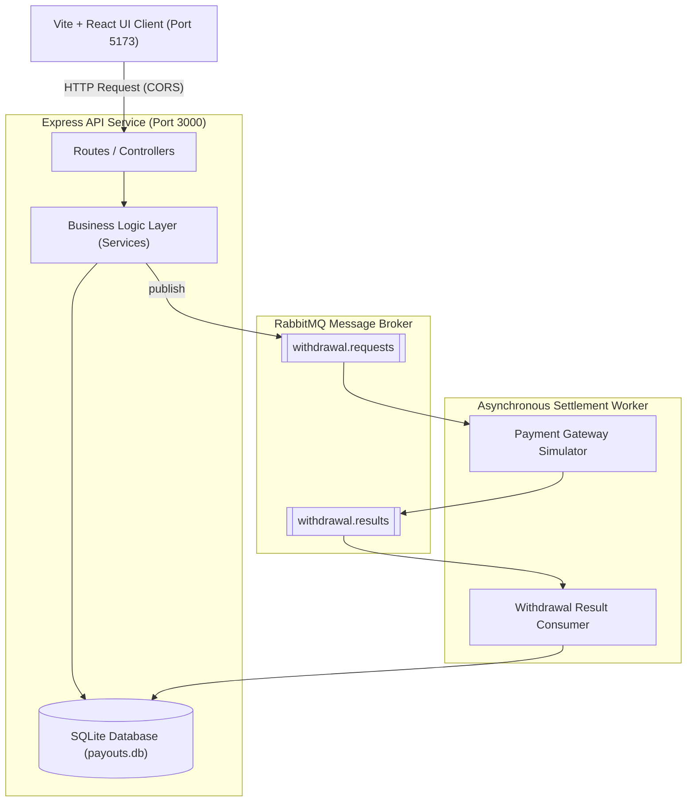
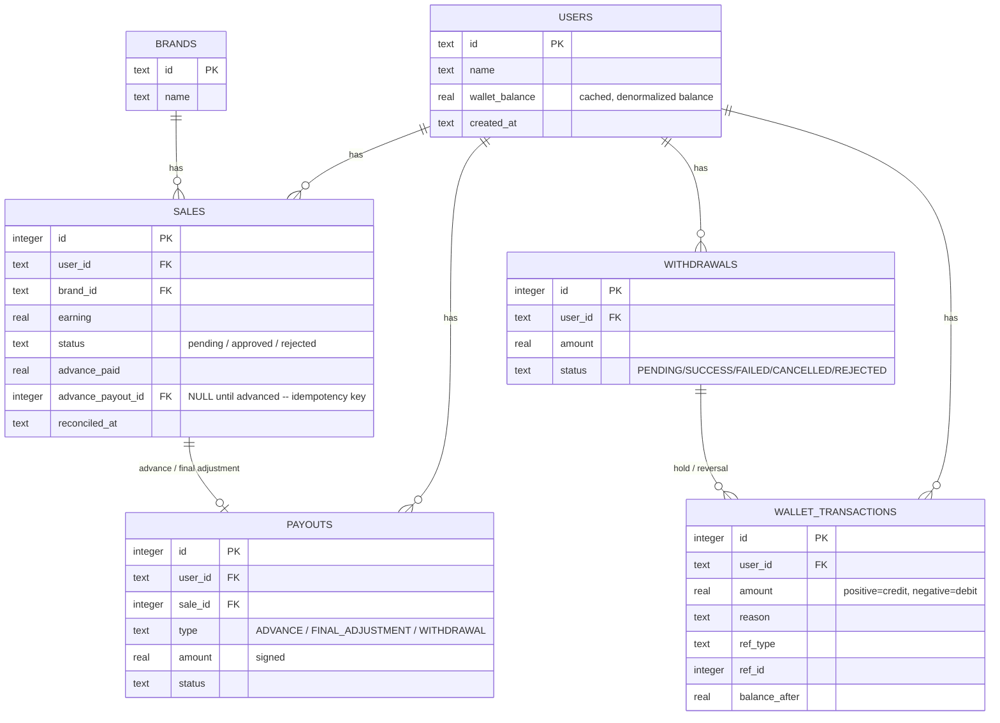

# Payout Management System — LLD & Implementation

A comprehensive Low-Level Design (LLD) and working implementation of a system that manages user payouts for affiliate sales — featuring advance payouts, reconciliation-driven final payouts, withdrawal restrictions, and failed-payout recovery.

The project is structured as a separate monorepo-style layout:
1. **[payout-management-system/](file:///c:/pj/payout-management-system/payout-management-system)**: Node.js (JavaScript) backend REST API using SQLite and RabbitMQ.
2. **[payout-ui/](file:///c:/pj/payout-management-system/payout-ui)**: A separate Vite + React frontend dashboard styled with a glassmorphic dark-mode interface.

---

## 1. System Architecture



- **API Service (Express)**: Manages incoming requests to create sales, check balances, perform reconciliations, and queue withdrawals.
- **Worker Service**: Standalone worker process that consumes withdrawal requests, simulates bank gateway processing, and processes outcome settlements asynchronously. Both shared a SQLite DB under WAL mode safely.

---

## 2. Relational Database Schema



*Note: Pre-seeded default profiles (`john_doe`, `brand_1`, `brand_2`, `brand_3`) are registered automatically on Express startup inside [server.js](file:///c:/pj/payout-management-system/payout-management-system/src/server.js).*

---

## 3. Class Design & Responsibilities

The codebase organizes responsibilities using a Layered Repository-Service Pattern:

| Layer | Component | Responsibility |
| :--- | :--- | :--- |
| **Repository (DAL)** | `UserRepository`, `BrandRepository`, `SaleRepository`, `PayoutRepository`, `WalletRepository`, `WithdrawalRepository` | Raw SQL query execution. Keeps queries localized and testable. |
| **Service (BLL)** | `AdvancePayoutService` | business logic for the 10% advance payout job. |
| **Service (BLL)** | `ReconciliationService` | Settle final payouts: Credits `earnings - advance` on approval; claws back `-advance` on rejection. |
| **Service (BLL)** | `WithdrawalService` | Handles wallet balance verification, cooldown checks, and publishes withdrawal requests. |
| **Service (BLL)** | `PayoutFailureRecoveryService` | Handles reversal logic to refund wallets and void cooldown logs on withdrawal failures. |
| **HTTP Layer** | Controllers + Express Router | Parses request parameters, calls services, handles CORS, and serializes response JSON payloads. |

---

## 4. Key API Endpoints

| Method | Route | Description |
| :--- | :--- | :--- |
| **GET** | `/health` | Verify Express application health |
| **POST** | `/sales` | Log a new pending sale |
| **GET** | `/sales` | List all sales (Filtered by `john_doe` in UI) |
| **GET** | `/users` | List pre-seeded user sessions (`john_doe`) |
| **GET** | `/brands` | List available affiliate brands |
| **POST** | `/admin/advance-payout/run` | Run the advance payout job (credits 10% of earnings) |
| **POST** | `/admin/sales/:id/reconcile` | Approve (`earning - advance`) or Reject (`-advance` clawback) a sale |
| **GET** | `/users/:userId/balance` | Fetch withdrawable wallet balance |
| **GET** | `/users/:userId/transactions` | Fetch full ledger transaction audit trail |
| **GET** | `/users/:userId/withdrawals` | Fetch withdrawal logs |
| **POST** | `/users/:userId/withdrawals` | Initiate a withdrawal (Checks 24h success cooldown) |
| **POST** | `/withdrawals/:id/status` | Settle/Fail a withdrawal request manually (Simulates Bank callbacks) |

---

## 5. Design Decisions & Concurrency Safety

1. **`BEGIN IMMEDIATE` Write Transaction Locking**:
   To prevent double-payments or double-withdrawals under race conditions, all database writes run inside a `withTransaction` block. This issues a SQLite `BEGIN IMMEDIATE` up-front, blocking concurrent threads until the transaction commits or rolls back (mimicking Postgres `SELECT FOR UPDATE`).
2. **Denormalized Balance + Append-Only Ledger**:
   `users.wallet_balance` is a cached balance column for high-speed reads. The true source of truth is the append-only `wallet_transactions` table. Updates to both the cache and ledger occur inside the same write-transaction to prevent drift.
3. **Idempotent Advance Payouts**:
   The advance-payout query filters for `status = 'pending' AND advance_payout_id IS NULL`. This structural constraint guarantees that running the job multiple times will never double-pay a sale.
4. **24h Cooldown Coexistence with Failure Recovery**:
   The cooldown check only checks the timestamp of the last *successful* withdrawal (`status = 'SUCCESS'`). If a withdrawal transitions to `FAILED`, `CANCELLED`, or `REJECTED`, the recovery service credits the balance back, writes a reversal transaction, and voids the cooldown so the user can immediately retry.

---

## 6. Project Setup & Startup

To run the application, make sure you have **Node.js >= 22.5** installed.

### Step 1: Install Dependencies
Open a terminal and run `npm install` inside both directories:
```bash
# Install backend dependencies
cd c:\pj\payout-management-system\payout-management-system
npm install

# Install frontend dependencies
cd c:\pj\payout-management-system\payout-ui
npm install
```

### Step 2: Start the Backend Server
```bash
cd c:\pj\payout-management-system\payout-management-system
npm start
```
*The Express server boots on `http://localhost:3000`.*

### Step 3: Start the React Frontend App
In a new terminal window:
```bash
cd c:\pj\payout-management-system\payout-ui
npm run dev
```
*Vite compiles the frontend assets and starts the dev server on **`http://localhost:5173`**.*

### Step 4: Run Tests (Optional)
To run the native backend test suite containing **26 test assertions**:
```bash
cd c:\pj\payout-management-system\payout-management-system
npm test
```

---

## 7. Worked Example Walkthrough

To verify the entire system lifecycle matching the SDE assignment sheet:
1. Open the UI dashboard at **`http://localhost:5173`**.
2. Click the **⚡ Seed 3x ₹40 Sales** button in the header. This logs three pending sales of ₹40 each for `john_doe` (Total pending: ₹120).
3. Click the **⚙ Run Advance Payout Job** button. The system pays a 10% advance (₹4 each, total ₹12 credited to the balance).
4. Reconcile the logged sales under the **Affiliate Sales** table:
   - **Sale #1**: Click **Reject** (Claws back ₹4 from balance: adjustment = -₹4).
   - **Sale #2**: Click **Approve** (Pays out remaining ₹36: adjustment = +₹36).
   - **Sale #3**: Click **Approve** (Pays out remaining ₹36: adjustment = +₹36).
5. The **Withdrawable Balance** will now show exactly **₹68** (Matches calculation: `-4 + 36 + 36 = 68`).
6. Click **Request Withdrawal** for ₹68. The balance immediately goes to ₹0, and a pending withdrawal is created.
7. Click **Fail** under the *Withdrawal logs* action column (Simulates a gateway error callback). The recovery service instantly refunds the ₹68 back to John Doe's wallet, voids the cooldown, and appends a `WITHDRAWAL_REVERSAL` audit row to the ledger.
# Faym

