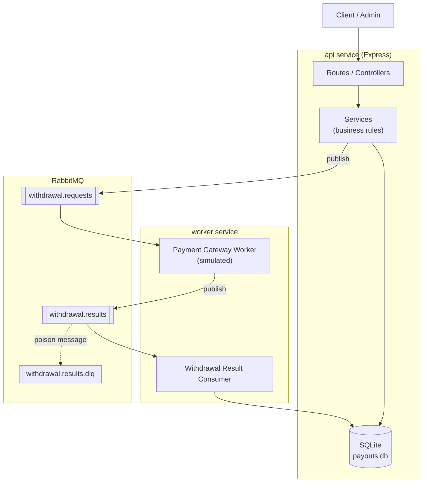
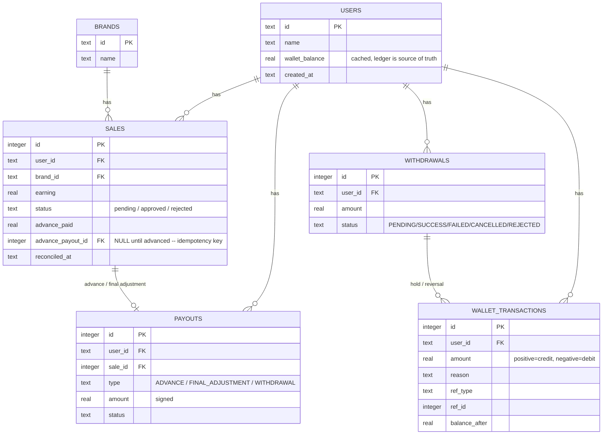
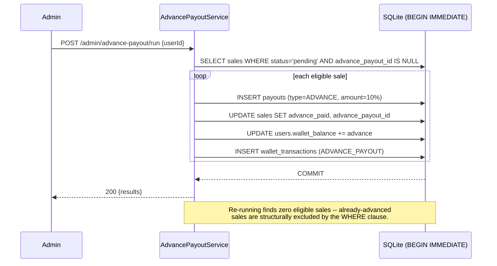
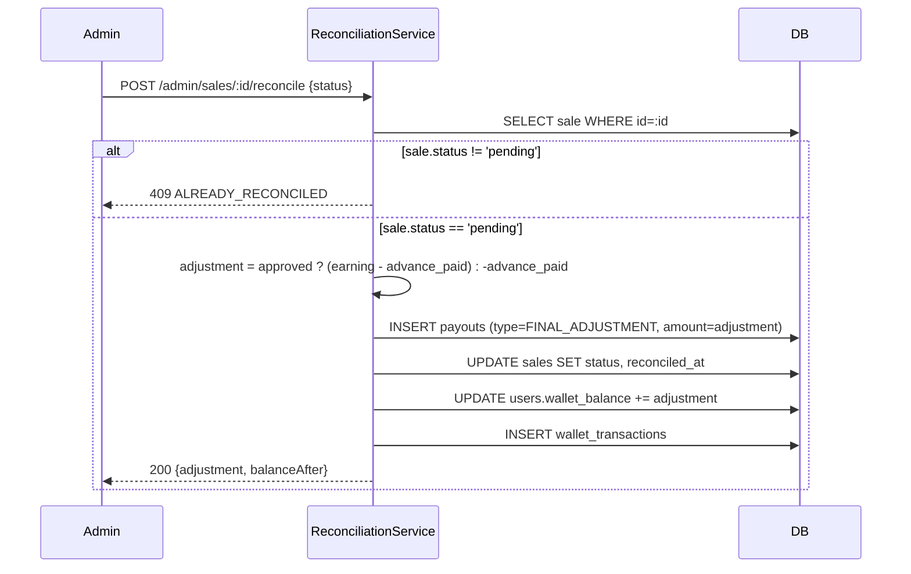

# Payout Management System

A low-level design and working implementation of a system that manages user
payouts for affiliate sales — advance payouts, reconciliation-driven final
payouts, withdrawal restrictions, and failed-payout recovery, plus a real
RabbitMQ-backed pipeline for processing withdrawals asynchronously.

Built for the "SDE Intern Assignment — User Payout Management System".

## Contents

- [Quick start](#quick-start)
- [Architecture](#architecture)
- [Database schema / ERD](#database-schema--erd)
- [Class design](#class-design)
- [Business rules -> code](#business-rules---code)
- [Sequence diagrams](#sequence-diagrams)
- [API reference](#api-reference)
- [Edge cases & failure handling](#edge-cases--failure-handling)
- [Design decisions & trade-offs](#design-decisions--trade-offs)
- [Testing](#testing)
- [Project structure](#project-structure)

## Quick start

Requires **Node.js >= 22.5** (for the built-in `node:sqlite` module — no
native compilation, no external DB server needed for local dev).

```bash
npm install
npm test        # 26 tests, all business rules + the spec's worked example
npm run demo    # runs the assignment's exact worked example end-to-end, prints the ledger
```

To run the full stack, including the RabbitMQ-based withdrawal pipeline:

```bash
docker compose up --build
# API:              http://localhost:3000
# RabbitMQ UI:       http://localhost:15672  (guest/guest)

node scripts/seed.js          # seeds brands/users/sales via HTTP
curl -X POST http://localhost:3000/admin/advance-payout/run \
  -H 'Content-Type: application/json' -d '{"userId":"john_doe"}'
curl http://localhost:3000/users/john_doe/balance
```

Without Docker, you can still run the API against a local SQLite file with
the queue disabled (publishing becomes a logged no-op) and settle
withdrawals manually via `POST /withdrawals/:id/status`:

```bash
npm start                      # http://localhost:3000, DB at data/payouts.db
```

## Architecture



**Why two separate deployables (`api`, `worker`)?** The API needs to answer
requests quickly (create sales, check balances). The withdrawal settlement
pipeline is inherently async and can be scaled independently — under load
you'd run more `worker` replicas without touching the API tier at all. Both
share one SQLite file over a Docker volume (safe because of WAL mode — see
[Trade-offs](#design-decisions--trade-offs)); in a multi-node deployment
this would be Postgres instead.

## Database schema / ERD



Full DDL with indexes: [`src/db/schema.sql`](src/db/schema.sql).

**Why a `wallet_transactions` ledger table at all**, given `users.wallet_balance`
already holds the number? Because a single mutable balance column can't
answer "why is this balance what it is" or be audited/replayed. Every
credit/debit that ever touches a wallet is recorded here, in the same DB
transaction as the balance update, so the cached column and the ledger can
never drift. See [Trade-offs](#design-decisions--trade-offs) for more.

## Class design

Manual dependency injection ([`src/container.js`](src/container.js)) wires
everything; nothing reaches for a global singleton, which is what makes the
whole system testable with a fresh in-memory DB per test.

| Layer | Classes | Responsibility |
|---|---|---|
| Repository | `UserRepository`, `BrandRepository`, `SaleRepository`, `PayoutRepository`, `WalletRepository`, `WithdrawalRepository` | Raw SQL access, one per table. No business logic. |
| Service | `UserService`, `BrandService`, `SaleService` | Basic CRUD + validation for reference data. |
| Service | `AdvancePayoutService` | Business Rule 1 — advance payouts, idempotent. |
| Service | `ReconciliationService` | Business Rule 2 — final payout adjustment on approve/reject. |
| Service | `WithdrawalService` | Business Rule 3 — withdrawal request, balance check, 24h cooldown, publishes to the queue. |
| Service | `PayoutFailureRecoveryService` | Question 2 — settles a withdrawal (SUCCESS, or credit-back on FAILED/CANCELLED/REJECTED). |
| Queue | `topology`, `publisher`, `paymentGatewayWorker`, `withdrawalResultConsumer` | RabbitMQ topology + producers/consumers for async withdrawal processing. |
| Web | Controllers + Express router | Thin HTTP adapters over the services above. |

## Business rules -> code

| Rule | Where it lives |
|---|---|
| Every pending sale gets a 10% advance | [`advancePayoutService.js`](src/services/advancePayoutService.js) |
| A sale is never advanced twice, even if the job re-runs | `sales.advance_payout_id IS NULL` filter in [`saleRepository.js`](src/repositories/saleRepository.js) — the check *is* the query, not a side flag that can be forgotten |
| Approved sale pays `earning - advance_paid` | [`reconciliationService.js`](src/services/reconciliationService.js) |
| Rejected sale claws back `-advance_paid` | same file |
| One withdrawal per 24h | [`withdrawalService.js`](src/services/withdrawalService.js), based on `findLastSuccessful()` |
| Failed/cancelled/rejected payout credits the amount back | [`payoutFailureRecoveryService.js`](src/services/payoutFailureRecoveryService.js) |
| User can re-withdraw the credited amount | same file — cooldown only ever looks at `status = 'SUCCESS'`, so a reversed withdrawal never blocks a retry |

## Sequence diagrams

### Advance payout job (idempotent, runs on demand or on a schedule)



### Reconciliation



### Withdrawal, via RabbitMQ (Question 2's failure-recovery path)

```mermaid
sequenceDiagram
    participant User
    participant API as WithdrawalService
    participant DB
    participant MQ as RabbitMQ
    participant GW as Gateway worker (simulated)
    participant RC as Result consumer

    User->>API: POST /users/:id/withdrawals {amount}
    API->>DB: check balance & 24h cooldown (last SUCCESS)
    API->>DB: INSERT withdrawals (PENDING); hold funds (-amount)
    DB-->>API: COMMIT
    API->>MQ: publish withdrawal.requests {withdrawalId}
    API-->>User: 201 {withdrawal: PENDING}

    MQ->>GW: consume withdrawal.requests
    GW->>GW: simulate calling the bank/UPI gateway
    GW->>MQ: publish withdrawal.results {withdrawalId, status}

    MQ->>RC: consume withdrawal.results
    RC->>DB: updateWithdrawalStatus(id, status)
    alt status in FAILED / CANCELLED / REJECTED
        RC->>DB: credit amount back; wallet_transactions WITHDRAWAL_REVERSAL
        Note over RC,DB: User's balance is restored, and because this<br/>withdrawal never became SUCCESS, no cooldown was ever set.
    else status == SUCCESS
        RC->>DB: mark SUCCESS only (funds were already held at request time)
    end
    RC->>MQ: ack
```

## API reference

Base URL: `http://localhost:3000`

| Method | Path | Purpose |
|---|---|---|
| POST | `/brands` | Create a brand |
| POST | `/users` | Create a user |
| POST | `/sales` | Create a pending sale `{userId, brandId, earning}` |
| GET | `/users/:userId/sales` | List a user's sales |
| POST | `/admin/advance-payout/run` | Run the advance-payout job. Body `{userId}` optional — omit to run for every eligible user |
| POST | `/admin/sales/:saleId/reconcile` | Reconcile one sale `{status: "approved"\|"rejected"}` |
| POST | `/admin/sales/reconcile-batch` | Reconcile many `{items: [{saleId, status}, ...]}` |
| GET | `/users/:userId/balance` | Current withdrawable balance |
| GET | `/users/:userId/transactions` | Full wallet ledger |
| GET | `/users/:userId/withdrawals` | Withdrawal history |
| POST | `/users/:userId/withdrawals` | Request a withdrawal `{amount}` — publishes to RabbitMQ |
| POST | `/withdrawals/:withdrawalId/status` | Settle a withdrawal `{status}` — this is what the queue consumer calls internally; also usable manually (e.g. in tests, or without Docker) |

Errors are JSON: `{ "error": "CODE", "message": "..." }` with an
appropriate HTTP status (404, 409, 422, 429). See
[`src/utils/errors.js`](src/utils/errors.js) for the full list of codes.

Example — full lifecycle:

```bash
curl -X POST localhost:3000/brands -d '{"id":"brand_1","name":"Brand One"}' -H 'Content-Type: application/json'
curl -X POST localhost:3000/users  -d '{"id":"john_doe","name":"John Doe"}' -H 'Content-Type: application/json'
curl -X POST localhost:3000/sales  -d '{"userId":"john_doe","brandId":"brand_1","earning":40}' -H 'Content-Type: application/json'

curl -X POST localhost:3000/admin/advance-payout/run -d '{"userId":"john_doe"}' -H 'Content-Type: application/json'
curl localhost:3000/users/john_doe/balance   # -> { "walletBalance": 4 }

curl -X POST localhost:3000/admin/sales/1/reconcile -d '{"status":"approved"}' -H 'Content-Type: application/json'
curl localhost:3000/users/john_doe/balance   # -> { "walletBalance": 40 }

curl -X POST localhost:3000/users/john_doe/withdrawals -d '{"amount":40}' -H 'Content-Type: application/json'
```

## Edge cases & failure handling

- **Advance payout job re-run any number of times** — never double-pays;
  see `advance_payout_id IS NULL` filter.
- **Sale reconciled twice** — second attempt returns `409
  ALREADY_RECONCILED`, no double adjustment.
- **Sale with zero earnings** — advance amount rounds to 0 and is skipped
  entirely (no zero-amount payout/ledger noise).
- **Withdrawal exceeds balance** — `422 INSUFFICIENT_BALANCE`, nothing
  written.
- **Second withdrawal within 24h of the last *successful* one** — `429
  WITHDRAWAL_COOLDOWN` with a `retryAt` timestamp. Explicitly does **not**
  count failed/cancelled/rejected withdrawals against the user — that's
  the whole point of Question 2.
- **A rejected sale's clawback exceeds the user's current balance** —
  allowed to go negative (a genuine debt: the user already withdrew money
  they weren't entitled to). The wallet ledger records exactly why. A
  future withdrawal request will simply fail with `INSUFFICIENT_BALANCE`
  until the debt is worked off by other approved sales.
- **Duplicate withdrawal-result delivery** (RabbitMQ redelivers on crash,
  or an operator resubmits a webhook) — a withdrawal can only transition
  out of `PENDING` once; the second attempt throws
  `InvalidStateTransitionError`, which the queue consumer treats as "safe
  to ignore, ack and move on" rather than a real error.
- **Message that can't be applied at all** (unknown withdrawal id, corrupt
  payload) — routed to `withdrawal.results.dlq` for manual inspection
  rather than looping forever.
- **RabbitMQ is down when a withdrawal is requested** — the DB transaction
  (hold funds + create withdrawal row) has already committed before we try
  to publish; a broker outage is logged, not thrown back to the caller, so
  the user isn't shown an error for money that was, in fact, correctly
  held. The message would need to be replayed by an operator — a known,
  documented trade-off of "at least once from the DB, best-effort publish"
  rather than a two-phase commit across SQLite and RabbitMQ.
- **Unknown user/brand referenced when creating a sale** — `404
  NOT_FOUND` before any row is written.
- **Non-numeric/negative earning or withdrawal amount** — `400
  BAD_REQUEST` from input validation in the service layer, not the
  database's CHECK constraints (better error messages; the CHECK
  constraints are a defense-in-depth backstop).

## Design decisions & trade-offs

**Should this use a queue?** Yes for withdrawals — see the architecture
diagram and sequence diagram above. The advance-payout job and
reconciliation, however, are deliberately **not** queued: their
correctness comes entirely from the `BEGIN IMMEDIATE` transaction and the
`advance_payout_id IS NULL` / `status = 'pending'` guards, and a queue
would add latency and operational surface without changing that. Queuing
buys you *scale and resilience for an external dependency* (the payment
gateway); it doesn't buy you correctness you don't already have from the
database.

**`node:sqlite` instead of Postgres/MySQL.** Node 22.5+ ships a built-in,
synchronous SQLite binding — no native module to compile (`better-sqlite3`
needs `node-gyp` + a C toolchain), no DB server to run for local
dev/tests. `BEGIN IMMEDIATE` gives the same "acquire the write lock
up-front" guarantee as `SELECT ... FOR UPDATE` in Postgres, which is what
makes the advance-payout job and withdrawal cooldown check safe under
concurrent calls. At real scale you'd move to Postgres for
proper row-level locking (rather than SQLite's whole-database write lock)
and horizontal read scaling — the schema in `schema.sql` is intentionally
close to standard SQL and ports over with minimal changes.

**A `wallet_transactions` ledger, not just a `wallet_balance` column.**
The column is a cache for fast reads; the ledger is the append-only source
of truth and audit trail. Both are updated in the same transaction, so
they can't drift, and any support ticket ("why is my balance X?") is
answerable by reading the ledger rather than trusting a mutable number.

**Rupees as rounded floats, not integer paise.** For a take-home this
keeps the numbers in the API matching the assignment's examples exactly
(₹4, ₹27, ₹68 rather than 400/2700/6800 paise). Every arithmetic step goes
through `round2()` to avoid `0.1 + 0.2 !== 0.3`-style float drift. A real
production ledger handling money at scale should store integer minor
units (paise) precisely to remove float rounding from the picture
entirely — noted here as the one place this implementation optimizes for
matching the spec's stated numbers over textbook financial-systems
practice.

**Withdrawals are their own table, not rows in `payouts`.** They have a
genuinely different lifecycle — `PENDING` awaiting an external gateway
callback, as opposed to advances/adjustments which are decided and final
the instant they're computed. Reusing one table would mean most columns
are meaningless for one type or the other.

**Funds are held at withdrawal *request* time, not at settlement time.**
If we waited until `SUCCESS` to debit, a user could fire off two
withdrawal requests against the same balance before either clears. Holding
immediately, then reversing on failure, is the standard "authorize, then
capture-or-void" pattern from payment processing.

**One process for both queue consumers (`src/queue/worker.js`).** In a
real org the payment-gateway integration and "our" settlement logic would
likely be owned by different teams/services. They're combined into one
process here so `docker compose up` demonstrates the full pipeline with a
single `worker` service; splitting them further is a deployment change,
not a code change — `startPaymentGatewayWorker()` and
`startWithdrawalResultConsumer()` are already independent functions.

**Publisher channel reuse, not open/close per message.** `getPublishChannel()`
in `src/queue/publisher.js` caches a single channel behind a Promise. A
sequence-diagram-perfect naive version would open a fresh AMQP connection
per publish; that's needless overhead at any real request volume.

**Why `QUEUE_ENABLED` as an escape hatch.** `npm test` and `npm run demo`
run against nothing but Node + SQLite — no Docker required to verify the
business logic. Setting `QUEUE_ENABLED=true` (which `docker-compose.yml`
does for the `api`/`worker` services) is what turns on the real RabbitMQ
publish; otherwise it's a logged no-op. This keeps "clone, `npm install`,
`npm test`" trivial while still shipping a genuine, runnable queue-based
pipeline via `docker compose up`.

## Testing

```bash
npm test
```

26 tests across `tests/*.test.js`, covering:

- Advance payout: correct 10%, idempotent re-runs, zero-earning sales
  skipped, multi-user batch run.
- Reconciliation: both worked examples from the spec (Case 1 approved,
  Case 2 rejected) plus the full 3-sale example reproducing the spec's
  stated ₹68, double-reconciliation rejected, batch reconciliation with
  partial failures.
- Withdrawals: balance check, 24h cooldown enforcement and expiry,
  input validation.
- Failure recovery (Question 2): FAILED/CANCELLED/REJECTED all credit the
  wallet back, immediate re-withdrawal after a failure (no cooldown
  penalty), SUCCESS doesn't double-move money, duplicate settlement is
  rejected.
- An end-to-end HTTP test exercising the whole lifecycle through the
  actual Express app (no mocking).

`npm run demo` runs the assignment's exact worked example
(three ₹40 sales -> ₹12 advance -> reconcile rejected/approved/approved ->
₹68 final adjustment -> withdraw -> simulate a failure -> confirm the
refund) against an in-memory DB and prints every step plus the full ledger.

## Project structure

```
payout-management-system/
├── docker-compose.yml       # RabbitMQ + api + worker
├── Dockerfile
├── src/
│   ├── db/
│   │   ├── schema.sql       # full DDL
│   │   └── connection.js    # node:sqlite + BEGIN IMMEDIATE transaction helper
│   ├── repositories/        # one per table, raw SQL only
│   ├── services/            # business rules live here
│   ├── controllers/         # thin HTTP adapters
│   ├── routes/index.js
│   ├── queue/                # RabbitMQ topology, publisher, workers
│   │   ├── topology.js
│   │   ├── publisher.js
│   │   ├── paymentGatewayWorker.js
│   │   ├── withdrawalResultConsumer.js
│   │   └── worker.js         # entrypoint for the `worker` service
│   ├── utils/                # money rounding, custom error classes
│   ├── container.js          # manual DI wiring
│   ├── app.js                # Express app + error middleware
│   └── server.js             # API entrypoint
├── scripts/
│   ├── demo.js               # reproduces the spec's worked example, in-memory
│   └── seed.js                # seeds a running server via HTTP
└── tests/                     # node:test, 26 tests, zero external deps
```
